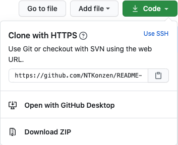
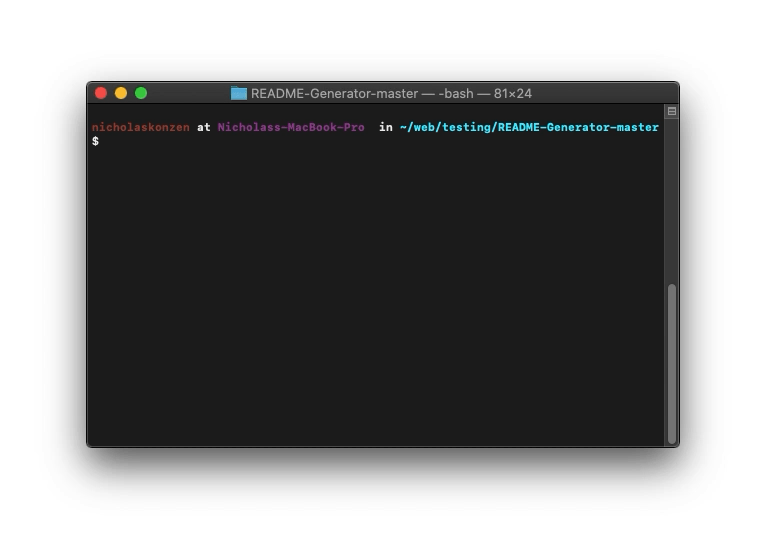
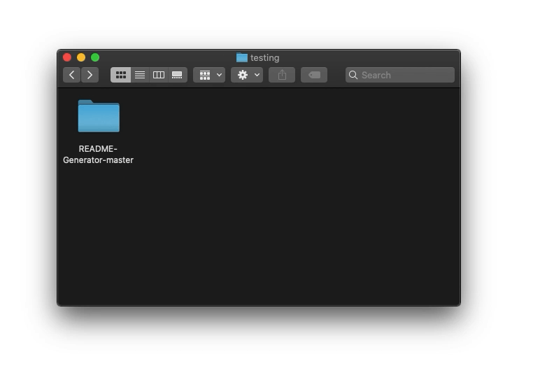

# README Generator #
[](#license)

### Table of Contents ###
* [Description](#description)
* [Installation](#installation)
* [Usage](#usage)
* [Contributors](#contributors)
* [Questions](#questions)
* [License](#license)

## Description ##

This is an application that dynamically generates a README.md file based on user input. I started this project because I needed a tool that helped me get past my README writers block that I get every time I sit down to write a README. The entire application is written in javascript and utilizes NPM with the Inquirer package along with the built-in File System package("fs"). For details on [how to install](#installation) or [how to use](#usage), see below.

This README was largely generated by this README Generator, though minor edits were made. To see the original that is entirely generated, click [here](./generated-readme-example.md)

### Installation ###

[Watch the tutorial](https://youtu.be/ZK9oT47J58o)

1. This project requires Node.js. If you don't have Node.js installed you can find it [here](https://nodejs.org/en/download/)
2. Download the README-Generator-master.zip file from my [GitHub Repository](https://github.com/NTKonzen/README-Generator) and unzip it

3. Move the unzipped folder to your preferred location in your file system

4. Navigate to the repository in your preferred command terminal
5. Run 'npm install' to install all the dependencies in the package.json file

6. Run ```npm start``` or ```node index.js``` and follow the instructions

### Usage ###

[Watch the tutorial](https://youtu.be/ZK9oT47J58o)

1. Run ```npm start``` or ```node index.js``` to start the program
2. Answer each question to the best of your ability following any instructions

3. Your README file will be generated in the 'generated files' folder
4. A new LICENSE file will ge generated in the 'generated files' folder. Be sure to include that in your project


### Contributors ###

* [Nicholas Konzen](https://github.com/NTKonzen)

### Questions ###
If you have any questions feel free to contact me on [GitHub](https://github.com/NTKonzen) or email me at nicholaskonzen@gmail.com.

---
#### License #### 

MIT License

Copyright (c) 2021 Nicholas Konzen

Permission is hereby granted, free of charge, to any person obtaining a copy
of this software and associated documentation files (the "Software"), to deal
in the Software without restriction, including without limitation the rights
to use, copy, modify, merge, publish, distribute, sublicense, and/or sell
copies of the Software, and to permit persons to whom the Software is
furnished to do so, subject to the following conditions:

The above copyright notice and this permission notice shall be included in all
copies or substantial portions of the Software.

THE SOFTWARE IS PROVIDED "AS IS", WITHOUT WARRANTY OF ANY KIND, EXPRESS OR
IMPLIED, INCLUDING BUT NOT LIMITED TO THE WARRANTIES OF MERCHANTABILITY,
FITNESS FOR A PARTICULAR PURPOSE AND NONINFRINGEMENT. IN NO EVENT SHALL THE
AUTHORS OR COPYRIGHT HOLDERS BE LIABLE FOR ANY CLAIM, DAMAGES OR OTHER
LIABILITY, WHETHER IN AN ACTION OF CONTRACT, TORT OR OTHERWISE, ARISING FROM,
OUT OF OR IN CONNECTION WITH THE SOFTWARE OR THE USE OR OTHER DEALINGS IN THE
SOFTWARE.